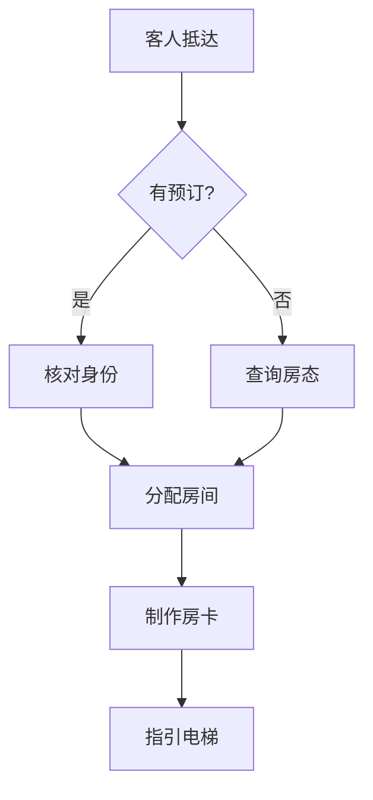

## 强制规则
所有文字输出必须是中文。思维导图节点内容全部中文。

## 做什么
将用户输入的文字内容转化为可视化思维导图。输出 Mermaid 格式代码，可直接在 Markdown 编辑器或 mermaid.live 渲染。

## 支持的图表类型

| 类型 | 触发词 | 输出格式 |
|------|--------|----------|
| 思维导图 | 思维导图/脑图/整理思路 | `mindmap` |
| 流程图 | 流程/SOP/步骤 | `flowchart TD/LR` |
| 组织架构 | 组织架构/汇报关系/部门 | `graph TD` |
| 时间线 | 时间线/甘特图/计划 | `gantt` |
| 鱼骨图 | 原因分析/鱼骨/因果 | `graph` (鱼骨布局) |

## 工作流程

### Step 1: 解析输入
输入文本/文件 → `Read` → 提取实体+关系（父子/顺序/并列/时间线）
⚠ **展示节点列表确认**，偏差则手动调整

### Step 2: 选择图表类型
层级→`mindmap` / 顺序→`flowchart TD`或`gantt` / 因果分支→`flowchart LR` / 汇报→`graph TD`
⚠ **展示建议类型让用户确认**，可手动指定

### Step 3: 生成 Mermaid 代码
节点中文 / 颜色少用 / 箭头精简 / ` ```mermaid ` 包裹
验证 `[]` `{}` 成对

### Step 4: 输出文件
.md: `docs/{主题}_mindmap.md` / 可选PNG: `mmdc`或`playwright`截图 → `os.startfile()`打开

### Step 5: 确认与迭代
⚠ 展示代码+文件链接，询问「是否符合预期？」→ 否回Step3，是则结束

## 异常处理
| 场景 | 处理方式 |
|------|---------|
| 输入<5个实体 | 提示补充或自动展开 |
| 嵌套>5层 | 拆2图（概要+细节） |
| Mermaid语法错 | `mmdc -i input.mmd -o test.png` 验证→自动修正 |
| 未指定类型 | 按规则自动选择→确认 |
| PNG生成失败 | 退化仅输出.md，提示Typora预览 |

## 酒店场景示例

**前厅SOP流程图**

