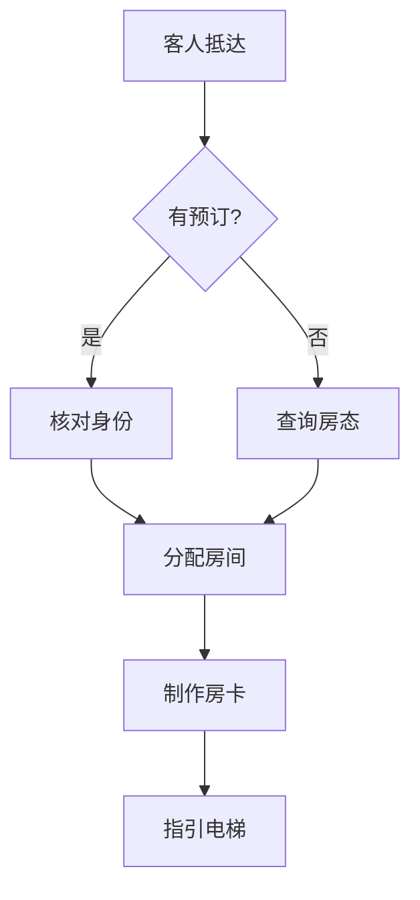

## 强制规则
所有文字输出必须是中文。思维导图节点内容全部中文。

## 做什么
将用户输入的文字内容转化为可视化思维导图。输出 Mermaid 格式代码，可直接在 Markdown 编辑器或 mermaid.live 渲染。

## 支持的图表类型

| 类型 | 触发词 | 输出格式 |
|------|--------|----------|
| 思维导图 | 思维导图/脑图/整理思路 | `mindmap` |
| 流程图 | 流程/SOP/步骤 | `flowchart TD/LR` |
| 组织架构 | 组织架构/汇报关系/部门 | `graph TD` |
| 时间线 | 时间线/甘特图/计划 | `gantt` |
| 鱼骨图 | 原因分析/鱼骨/因果 | `graph` (鱼骨布局) |

## 工作流程

### Step 1: 解析输入
- **输入**: 用户文本/关键词/会议记录/结构化数据
- **工具**: `Read` 读取文件 / 直接解析用户消息
- **动作**: 提取核心实体和关系，识别层次结构（父子/顺序/并列/时间线）
- **输出**: 结构化中间表示（节点列表 + 关系列表）
- ⚠ **检查点**: 将节点列表展示给用户，确认实体和关系提取是否正确。若偏差则手动调整。

### Step 2: 选择图表类型
- **输入**: 结构化中间表示
- **决策**: 按以下规则选择
  - 有层级关系 → `mindmap`
  - 有时间顺序 → `flowchart TD` 或 `gantt`
  - 有因果关系/分支 → `flowchart LR`
  - 有汇报关系 → `graph TD`
- **输出**: 图表类型 + 布局方向
- ⚠ **检查点**: 展示建议的图表类型，询问用户是否接受。若否，让用户手动指定类型。

### Step 3: 生成 Mermaid 代码
- **输入**: 结构 + 类型
- **规则**: 节点内容中文 / 颜色尽量少用 / 箭头文字精简
- **输出**: Mermaid 代码块（含 ` ```mermaid ` 包裹）
- **格式验证**: 检查方括号 `[]` 和花括号 `{}` 是否成对

### Step 4: 输出文件
- **.md 文件**: `docs/{主题}_mindmap.md`（含 Mermaid 代码 + 说明）
- **可选 PNG**: 用 Python `subprocess` 调用 `mmdc`（mermaid-cli）或 `playwright` 截图
- **输出**: 路径展示给用户，自动 `os.startfile()` 打开

### Step 5: 确认与迭代
- **展示**: 向用户展示 Mermaid 代码 + `docs/` 下输出的 .md 文件链接
- ⚠ **检查点**: 询问「图表是否符合预期？是否需要调整节点/连线/布局？」
- **修改**: 若需调整 → 回到Step 3重新生成
- **终版**: 用户明确确认OK后结束

## 酒店场景示例

**前厅SOP流程图**


**餐饮部组织架构**
```mermaid
graph TD
  行政总厨 --> 中餐主厨
  行政总厨 --> 西餐主厨
  行政总厨 --> 饼房主厨
  中餐主厨 --> 炒锅
  中餐主厨 --> 砧板
  西餐主厨 --> 热菜
  西餐主厨 --> 冷菜
